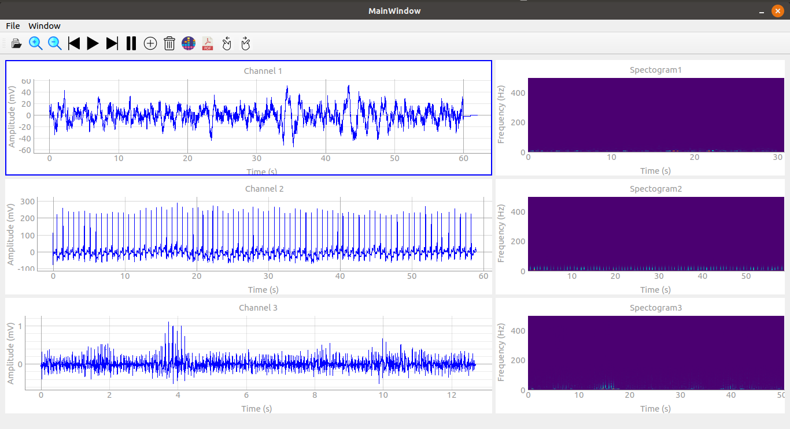

# Signal viewer

It was a team project done by:

[Marwa Abdelaal](https://github.com/MarwaAbdelAal), 
[Meirna Kamal](https://github.com/Meirna-kamal), 
[Nada Ezzat](https://github.com/nadaezzat-99), 
[Noura Mahmoud](https://github.com/Noura-Mahmoud), 

- The user can open 3 different medical signals in 3 different channels, control the signal with `play`/`pause`/`stop` buttons, `Zoom-in`, `zoom-out` and `scroll` through the signal.
  
- There is a spectrogram for each signal.

- You can print your results using the `pdf` button.



## Run the app

```bash
python main.py
```